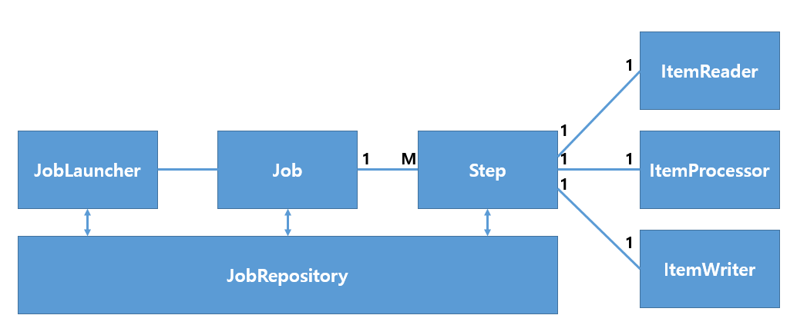

# 스프링 부트 배치

- 배치는 1년 이상의 휴면 유저의 상태를 **INACTIVE** 상태로 만들어주기 위해 사용했습니다. 
- 일괄처리 특성상 대량의 데이터를 처리하는 작업이기 때문에 시스템 I/O를 최소화 해야하는 점을 고려했습니다.
- 배치 기능은 **[처음 시작하는 스프링부트 2]** 도서를 통해 진행했습니다.

# 배치 기본 설명
- 배치 서비스는 다음과 같이 작동합니다.

  **읽기(read)** : 데이터베이스에서 데이터를 가져옵니다.
  
  **처리(processiong)** : 데이터를 원하는 방식으로 가공/처리 합니다.
  
  **쓰기(write)** : 가공/처리한 데이터를 다시 데이터베이스에 저장합니다.
  
- 배치 서비스는 하나의 일감(Job)에 여러개의 단계(Step)을 두고, 각 단계대로 배치의 흐름을 구현합니다.



- 배치 관련 Dependency [build.gradle]
```gradle
dependencies {
  implementation 'org.springframework.boot:spring-boot-starter-batch'
}
```

- UserStatus와 Grad를 Enum 타입으로 각각 생성
```java
/*
* 회원 상태
* */
public enum UserStatus {
    ACTIVE,INACTIVE
}

/*
* 회원의 등급
* */
public enum Grade {
    VIP,GOLD,FAMILY
}

```

- User 객체에 enum타입의 클래스 매칭 
```java
package com.example.ITBook.common.domain;

import com.example.ITBook.common.enums.Authority;
import com.example.ITBook.common.enums.Grade;
import com.example.ITBook.common.enums.SocialType;
import com.example.ITBook.common.enums.UserStatus;
import com.fasterxml.jackson.annotation.JsonIgnore;
import lombok.*;

import javax.persistence.*;

import java.io.Serializable;
import java.time.LocalDateTime;

/*
 * 회원 테이블
 * */

@Builder
@Entity
@Table(name = "user")
@Data @AllArgsConstructor @NoArgsConstructor
public class User implements Serializable{
	
	private static final long serialVersionUID = 1L;
	
    @Id
    @GeneratedValue(strategy = GenerationType.IDENTITY)
    @Column(name = "user_no")
    private Long userNo;
    
    @Column(name = "identity",length = 255)
    private String identity;
    @Column(name = "name",length = 50)
    private String name;
    @JsonIgnore
    @Column(name = "password",length = 255)
    private String password;
    @Column(name = "email",length = 255)
    private String email;

    @Column(name = "created_date",nullable = true)
    private LocalDateTime createdDate;
    @Column(name = "updated_date",nullable = true)
    private LocalDateTime updatedDate;

    // OAuth
    @Column(name = "principal",length = 255,nullable = true)
    private String principal;

    @Column(name = "social_type")
    private SocialType socialType;

    // Batch
    @Column(name = "status")
    private UserStatus status; // 추가
    @Column(name = "grade")
    private Grade grade; // 추가
    
    @Column(name = "phone",length = 255)
    private String phone;
    @Column(name = "address_1",length = 50)
    private String address1;
    @Column(name = "address_2",length = 255)
    private String address2;
    @Column(name = "address_3",length = 255)
    private String address3;
    
    @Column(name = "mileage",length = 7,nullable = true)
    private int mileage;

    public void setCreatedDate() {
        this.createdDate = LocalDateTime.now();
    }

    public void setUpdatedDate() {
        this.updatedDate = LocalDateTime.now();
    }

    public User setInactive(){
        this.status = UserStatus.INACTIVE;
        return this;
    }


}

```

- 배치 작업을 처리하기 위한 Configure [InactiveUserJobConfig.java]

```java
package com.example.ITBook.batch.job;

import com.example.ITBook.batch.job.decider.InactiveJobExecutionDecider;
import com.example.ITBook.batch.job.listener.InactiveJobListener;
import com.example.ITBook.common.domain.User;
import com.example.ITBook.common.enums.UserStatus;
import com.example.ITBook.user.repository.UserRepository;
import lombok.AllArgsConstructor;
import lombok.extern.slf4j.Slf4j;
import org.springframework.batch.core.Job;
import org.springframework.batch.core.Step;
import org.springframework.batch.core.configuration.annotation.JobBuilderFactory;
import org.springframework.batch.core.configuration.annotation.JobScope;
import org.springframework.batch.core.configuration.annotation.StepBuilderFactory;
import org.springframework.batch.core.configuration.annotation.StepScope;
import org.springframework.batch.core.job.builder.FlowBuilder;
import org.springframework.batch.core.job.flow.Flow;
import org.springframework.batch.core.job.flow.FlowExecutionStatus;
import org.springframework.batch.item.ItemProcessor;
import org.springframework.batch.item.ItemWriter;
import org.springframework.batch.item.database.JpaItemWriter;
import org.springframework.batch.item.support.ListItemReader;
import org.springframework.beans.factory.annotation.Value;
import org.springframework.context.annotation.Bean;
import org.springframework.context.annotation.Configuration;
import org.springframework.core.task.SimpleAsyncTaskExecutor;
import org.springframework.core.task.TaskExecutor;

import javax.persistence.EntityManagerFactory;
import java.time.LocalDateTime;
import java.util.List;
import java.util.stream.IntStream;


/*
* 1년 이상 휴면 유저 비활성화 배치
* @author : cheoljin
* */
@AllArgsConstructor
@Configuration
@Slf4j
public class InactiveUserJobConfig {

	private UserRepository userRepository;// 유저 정보 Repository

	private static final int CHUNK_SIZE         = 15;//청크(한 번에 처리할 JOB) 사이즈
	private static final int MULTY_FLOW_SIZE    = 5;// 멀티 플로우 사이즈
	private static final int PARTITION_SIZE     = 5;// 파티션 사이즈
	private static final int MULIY_THREAD_SIZE  = 2;// 멀티 스레드 사이즈
    private static final int HUMENT_YEAR        = 1;// 휴면 유저를 결정할 년수
	private final EntityManagerFactory entityManagerFactory;//영속성 관리 객체

    //Job 빈 등록
    @Bean
    public Job inactiveUserJob(JobBuilderFactory jobBuilderFactory
                                ,InactiveJobListener inactiveJobListener, Step partitionerStep) {

        log.info("InactiveUserJobConfig.inactiveUserJob :::");

        return jobBuilderFactory.get("InactiveUserJob")//InactiveUserJob이라는 이름의 JobBuilder를 생성
                //.preventRestart()// Job의 재실행을 막는다
                .listener(inactiveJobListener)
                .start(partitionerStep) // inactivejobStep이 제일 먼저 실행 되도록 설정
                .build();

    }

    /*
    * partitioner 방식으로 flow를 진행
    * @param : inactiveUserJobStep
    * @return
    * */
    @Bean
    @JobScope
    public Step partitionerStep(StepBuilderFactory stepBuilderFactory, Step inactiveUserJobStep) {

        log.info("InactiveUserJobConfig.partitionerStep :::");

        return stepBuilderFactory
                .get("partitionerStep")
                .partitioner("partitionerStep",new InactiveJobPartitioner())
                .gridSize(PARTITION_SIZE)
                .step(inactiveUserJobStep)
                .taskExecutor(taskExecutor())
                .build();
    }

    //Step 빈 등록
    @Bean
    public Step inactiveUserJobStep(StepBuilderFactory stepBuilderFactory, ListItemReader<User> inactiveUserReader
                                , InactiveJobListener inactiveJobListener, TaskExecutor taskExecutor) {

        log.info("InactiveUserJobConfig.inactiveUserJobStep :::");

        return stepBuilderFactory.get("inactiveUserJobStep")//inactiveUserJobStep라는 이름의 StepBuilder 생성
                .<User, User> chunk(CHUNK_SIZE) // chunk I/O 타입 설정, 커밋 단위 10
                .reader(inactiveUserReader) // Step의 reader,processor,writer 설정
                .processor(inactiveUserProcessor())
                .writer(activeUserWriter())
                .listener(inactiveJobListener)
                .taskExecutor(taskExecutor)
                .throttleLimit(MULIY_THREAD_SIZE)
                .build();
    }

    /*
    * 업무 실행
    * */
    @Bean
    public TaskExecutor taskExecutor() {

        log.info("InactiveUserJobConfig.taskExecutor :::");

        return new SimpleAsyncTaskExecutor("Batch_Task");
    }

    /*
    * 데이터 베이스에서 배치 처리할 데이터를 불러오는 작업
    * 리스트 타입으로 ITemReder를 불러옴
    * */
    @StepScope
    @Bean
    public ListItemReader<User> inactiveUserReader(@Value("#{stepExecutionContext[grade]}") String grade,
                                                        UserRepository userRepository) {

        log.info("current thread name is {}", Thread.currentThread().getName());

        //1년이 지난 상태가 ACTIVE인 유저들
        List<User> oldUsers = userRepository.findByUpdatedDateBeforeAndStatusEquals(LocalDateTime.now().minusYears(HUMENT_YEAR),UserStatus.ACTIVE);


        //LocalDateTime now = LocalDateTime.ofInstant(nowDate.toInstant(), ZoneId.systemDefault());

        //List<User> oldUsers = userRepository.findByUpdatedDateBeforeAndStatusEquals(now.minusYears(1),UserStatus.ACTIVE);


        /*JpaPagingItemReader<User> jpaPagingItemReader = new JpaPagingItemReader() {
            @Override
            public int getPage() {return 0;}
        };
        String OldUserSelectQuery = "select u " +
                                    "from User as u " +
                                    "where u.updated_date < :updatedDate and u.status = :status";

        jpaPagingItemReader.setQueryString(OldUserSelectQuery);

        Map<String,Object> map = new HashMap<String,Object>();
        map.put("updatedDate",LocalDateTime.now().minusYears(1));
        map.put("status",UserStatus.ACTIVE);

        jpaPagingItemReader.setParameterValues(map);// 쿼리에 사용할 파라미터 지정
        jpaPagingItemReader.setEntityManagerFactory(entityManagerFactory);//트랜잭션 관리
        jpaPagingItemReader.setPageSize(CHUNK_SIZE);//한 번에 읽어올 크기 지정*/

        return new ListItemReader<>(oldUsers);
    }

    /*
    * 배치 작업 처리
    * */
    @Bean
    public ItemProcessor<User,User> inactiveUserProcessor() {
        return User::setInactive;// 휴면 전환

    }

    /*
    * 배치 작업 처리 후 데이터 베이스에 저장
    *  entityManagerFactory만 설정하면, processor에서 넘어온 데이터를 청크 단위로 저장한다.
    * */
    @Bean
    public ItemWriter<User> activeUserWriter() {
        JpaItemWriter<User> jpaItemWriter = new JpaItemWriter<>();

        jpaItemWriter.setEntityManagerFactory(entityManagerFactory);

        return jpaItemWriter;
    }

    /*****************************************************************************/
    // 배치 예제를 처리 방법. 현재 파티셔닝 방식으로 진행했고, 그 전에 아래 단일 Flow와 멀티 Flow로 진행했습니다.
    // 따라서 아래 빈은 현재 사용하고 있지 않기 때문에 Bean을 삭제해줬습니다.

    /*
     * 멀티 플로우로 스텝을 처리
     * @Bean 삭제
     * @Param : inactiveUserJobStep
     * @Return
     * */
    public Flow multiFlow(Step inactiveUserJobStep) {

        log.info("InactiveUserJobConfig.multiFlow :::");

        Flow[] flows = new Flow[MULTY_FLOW_SIZE];

        IntStream.range(0,flows.length).forEach(i -> {
            flows[i] = new FlowBuilder<Flow>("MultiFlow"+i)
                    .from(inactiveJobFlow(inactiveUserJobStep)).end();

        });

        return new FlowBuilder<Flow>("MultiFlowTest")
                .split(taskExecutor())
                .add(flows)
                .build();
    }

    /*
     * 단일 플로우로 스텝을 처리
     * @Bean 삭제
     * @Param : inactiveUserJobStep
     * @Return
     * */
    public Flow inactiveJobFlow(Step inactiveUserJobStep) {

        log.info("InactiveUserJobConfig.inactiveJobFlow :::");

        FlowBuilder<Flow> flowBuilder = new FlowBuilder<>("inactiveJobFlow");

        return flowBuilder
                .start(new InactiveJobExecutionDecider())//Job을 실행시킬지를 결정
                .on(FlowExecutionStatus.FAILED.getName()).end()
                .on(FlowExecutionStatus.COMPLETED.getName()).to(inactiveUserJobStep).end();

    }
}


```

- 배치의 Job Flow를 회원 등급을 기준으로 Partition을 나눠서 파티션에 따라 배치 Job을 진행하는 Partitioner [InactiveJobPartitioner.java] 
```java
package com.example.ITBook.batch.job;

import com.example.ITBook.common.enums.Grade;
import org.springframework.batch.core.partition.support.Partitioner;
import org.springframework.batch.item.ExecutionContext;

import java.util.HashMap;
import java.util.Map;

/*
* 휴면 유저의 Job Flow를 Partitioning 방식으로 처리할 Partitioner
* */
public class InactiveJobPartitioner implements Partitioner {

    private static final String GRADE = "grade";
    private static final String INACTIVE_USER_TASK = "InactiveUserTask";

    @Override
    public Map<String, ExecutionContext> partition(int gridSize) {

        Map<String,ExecutionContext> map = new HashMap<>(gridSize);
        Grade[] grades = Grade.values();

        for (int i = 0, loop = grades.length; i < loop; i++) {

            ExecutionContext context = new ExecutionContext();
            context.putString(GRADE,grades[i].name());
            map.put(INACTIVE_USER_TASK+i,context);
        }


        return map;
    }
}

```

- 배치를 처리할지 결정하는 decider [InactiveJobExecutionDecider.java]
```java
package com.example.ITBook.batch.job.decider;

import lombok.extern.slf4j.Slf4j;
import org.springframework.batch.core.JobExecution;
import org.springframework.batch.core.StepExecution;
import org.springframework.batch.core.job.flow.FlowExecutionStatus;
import org.springframework.batch.core.job.flow.JobExecutionDecider;

import java.util.Random;

/*
* 휴면 유저 Flow를 실행할지를 결정하는 JobExecurtiondecider
* */

@Slf4j
public class InactiveJobExecutionDecider implements JobExecutionDecider {

    @Override
    public FlowExecutionStatus decide(JobExecution jobExecution, StepExecution stepExecution) {

        if (new Random().nextInt() > 0) {
            log.info("FlowExecutionStatus.COMPLETED");
            return FlowExecutionStatus.COMPLETED;
        }

        log.info("FlowExecutionStatus.FAILED");
        return FlowExecutionStatus.FAILED;
    }
}

```

- 배치 처리 전/후 작업을 하는 linstener [InactiveJobListener.java]
```java
package com.example.ITBook.batch.job.listener;

import lombok.extern.slf4j.Slf4j;
import org.springframework.batch.core.JobExecution;
import org.springframework.batch.core.JobExecutionListener;
import org.springframework.stereotype.Component;

/*
* 휴면 유저 Job의 요청 전/후를 처리할 Listener
* */

@Slf4j
@Component
public class InactiveJobListener implements JobExecutionListener {
    @Override
    public void beforeJob(JobExecution jobExecution) {
        log.info("before job");
    }

    @Override
    public void afterJob(JobExecution jobExecution) {
        log.info("after job");
    }
}

```

- 배치의 read/process/writer 작업을 한 번에 묶어 처리해주느느 Tasklet [InactiveItemTasklet.java]
- 개인적으로 이 Tasklet은 어떻게 처리 되는지 모르겠네요..
```java
package com.example.ITBook.batch.job;

import com.example.ITBook.common.domain.User;
import com.example.ITBook.common.enums.UserStatus;
import com.example.ITBook.user.repository.UserRepository;
import org.springframework.batch.core.StepContribution;
import org.springframework.batch.core.scope.context.ChunkContext;
import org.springframework.batch.core.step.tasklet.Tasklet;
import org.springframework.batch.repeat.RepeatStatus;
import org.springframework.beans.factory.annotation.Autowired;
import org.springframework.stereotype.Component;

import java.time.LocalDateTime;
import java.time.ZoneId;
import java.util.Date;
import java.util.List;
import java.util.stream.Collectors;

/*
* 휴면 유저 배치의 Read,process,write를 하나의 Task로 처리할 Tasklet
* */

@Component
public class InactiveItemTasklet implements Tasklet {

    @Autowired
    private UserRepository userRepository;

    @Override
    public RepeatStatus execute(StepContribution contribution, ChunkContext chunkContext) throws Exception {

        Date nowDate = (Date) chunkContext.getStepContext().getJobParameters().get("nowDate");

        LocalDateTime now = LocalDateTime.ofInstant(nowDate.toInstant(), ZoneId.systemDefault());

        List<User> olderUsers = userRepository.findByUpdatedDateBeforeAndStatusEquals(now.minusYears(1), UserStatus.ACTIVE);

        //processor
        olderUsers = olderUsers.stream()
                    .map(User::setInactive)
                    .collect(Collectors.toList());

        userRepository.saveAll(olderUsers);

        return RepeatStatus.FINISHED;
    }
}

```
