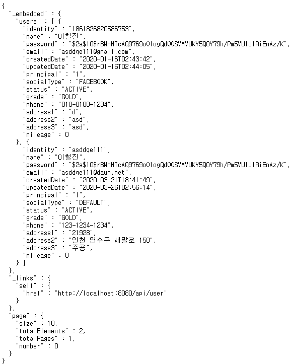

# Rest Api

- 기존 MVC 패턴을 통해 웹 요청을 받아 세부적인 요청을 서비스에서 처리하도록 했지만, 단순한 요청을 받아 데이터를 있는 그대로 반환할 때는 비용이
낭비 될 수 있기 때문에 도메인과 repository만을 이용한 처리 서비스와 외부 요청이 들어왔을 때, 확장성을 용이하게 하기 위해 **Rest Api**를 사용하여씁니다.

- 기본 **base-uri 패턴**은 /api로 시작하게 했고, **HATOES** 라이브러리를 사용하여 user 객체를 **JSON**타입으로 리턴해 주는 로직을 만들었습니다.

- Rest Api 관련 설정_1 [application.yml] 

```yml
data:
    rest:
      base-path: /api
      default-page-size: 10
      max-page-size: 10
```

- Rest Api 관련 Dependency 추가 [build.gradle]

```gradle
dependencies {
  implementation ('org.springframework.boot:spring-boot-starter-data-rest')
}
```

- Rest 관련 Controller [UserRestApiController.java]
- **HATOES** 라이브러리가 1.X 버전으로 업그레이드 되면서 사용 객체가 달라졌는데, **Resources<T>**에 해당하는 클래스는 **ColectionModel<T>**로 변경 되었고,
**PagedResources<T>**에 해당하는 클래스는 **PagedModel<T>**로 변경 됐습니다.

```java
package com.example.ITBook.restApi.web;

import com.example.ITBook.common.domain.User;
import com.example.ITBook.restApi.repository.UserRestRepository;
import com.example.ITBook.user.repository.UserRepository;
import lombok.AllArgsConstructor;
import lombok.extern.slf4j.Slf4j;
import org.springframework.data.domain.Page;
import org.springframework.data.domain.Pageable;
import org.springframework.data.rest.webmvc.RepositoryRestController;
import org.springframework.data.web.PageableDefault;
import org.springframework.hateoas.CollectionModel;
import org.springframework.hateoas.PagedModel;
import org.springframework.web.bind.annotation.*;

import static org.springframework.hateoas.server.mvc.WebMvcLinkBuilder.linkTo;
import static org.springframework.hateoas.server.mvc.WebMvcLinkBuilder.methodOn;


/*
* 회원정보 Rest Controller
* */
@Slf4j
@RequestMapping("/api/user")
@AllArgsConstructor
@RepositoryRestController
public class UserRestApiController {

    private UserRestRepository userRestRepository;

    /*
    * 현재 HATOES 버전 1.0 이상
    * HATOES 1.0 이전 버전에서 사용되던 Resources<T>는 CollectionModel<T>로 변경, PagedResources<T>는 PagedModel<T>로 변경
    * */
    @GetMapping()
    @ResponseBody
    public CollectionModel<User> userApiController(@PageableDefault Pageable pageable) throws Exception {

        log.info("UserRestApiController.userApiController :::");
        
        Page<User> userList = userRestRepository.findAll(pageable);

        // 페이지 정보를 담는 PageMetadata 객체를 생성
        PagedModel.PageMetadata pageMetadata =
                new PagedModel.PageMetadata(pageable.getPageSize(),userList.getNumber(),userList.getTotalElements());

        // 컬렉션의 페이지 리소스 정보를 추가적으로 제공하는 PagedResources 객체 생성 후 반환
        PagedModel<User> resources = new PagedModel<>(userList.getContent(),pageMetadata);
        // 필요한 링크를 추가 : 요청된 각각의 Board를 나타내는 'self' 하나만 임시로 추가함
        resources.add(linkTo(methodOn(UserRestApiController.class).userApiController(pageable)).withSelfRel());

        return resources;
    }
}

```

- 회원 정보 Rest Repository [UserRestRepository.java]
```java
package com.example.ITBook.restApi.repository;

import com.example.ITBook.common.domain.User;
import org.springframework.data.jpa.repository.JpaRepository;
import org.springframework.data.repository.query.Param;
import org.springframework.data.rest.core.annotation.RepositoryRestResource;
import org.springframework.data.rest.core.annotation.RestResource;

import java.util.List;

@RepositoryRestResource()// 컨트롤러와 서비스 영역 없이 미리 내부적으로 정의되어 있는 로직을 따라 처리된다.
public interface UserRestRepository extends JpaRepository<User,Long> {


    @RestResource(exported = false)
    List<User> findByName(@Param("name") String name);
}

```
- 아래는 **/api/user**로 접속하여 나온 결과물 입니다.



- 결과물 중에 노출하고싶지 않은 데이터가 있을 때에는 해당 필드에 **@JsonIgnore** 어노테이션을 붙입니다. * (아래 User 클래스 name필드 참조)

```java
package com.example.ITBook.common.domain;

import com.example.ITBook.common.enums.Authority;
import com.example.ITBook.common.enums.Grade;
import com.example.ITBook.common.enums.SocialType;
import com.example.ITBook.common.enums.UserStatus;
import com.fasterxml.jackson.annotation.JsonIgnore;
import lombok.*;
import org.springframework.security.core.GrantedAuthority;

import javax.persistence.*;

import java.io.Serializable;
import java.time.LocalDateTime;
import java.util.ArrayList;
import java.util.Collection;
import java.util.List;

/*
 * 회원 테이블
 * */

@Builder
@Entity
@Table(name = "user")
@Data @AllArgsConstructor @NoArgsConstructor
public class User implements Serializable{
	
	private static final long serialVersionUID = 1L;
	
    @Id
    @GeneratedValue(strategy = GenerationType.IDENTITY)
    @Column(name = "user_no")
    private Long userNo;
    
    @Column(name = "identity",length = 255)
    private String identity;
    @Column(name = "name",length = 50)
    private String name;
    @JsonIgnore
    @Column(name = "password",length = 255)
    private String password;
    @Column(name = "email",length = 255)
    private String email;

    @Column(name = "created_date",nullable = true)
    private LocalDateTime createdDate;
    @Column(name = "updated_date",nullable = true)
    private LocalDateTime updatedDate;

    // OAuth
    @Column(name = "principal",length = 255,nullable = true)
    private String principal;

    @Column(name = "social_type")
    private SocialType socialType;

    // Batch
    @Column(name = "status")
    private UserStatus status; // 추가
    @Column(name = "grade")
    private Grade grade; // 추가
    
    @Column(name = "phone",length = 255)
    private String phone;
    @Column(name = "address_1",length = 50)
    private String address1;
    @Column(name = "address_2",length = 255)
    private String address2;
    @Column(name = "address_3",length = 255)
    private String address3;
    
    @Column(name = "mileage",length = 7,nullable = true)
    private int mileage;

    public void setCreatedDate() {
        this.createdDate = LocalDateTime.now();
    }

    public void setUpdatedDate() {
        this.updatedDate = LocalDateTime.now();
    }

    public User setInactive(){
        this.status = UserStatus.INACTIVE;
        return this;
    }


}

```

- **@JsonIgnore** 어노테이션을 이용해 결과 재 도출


